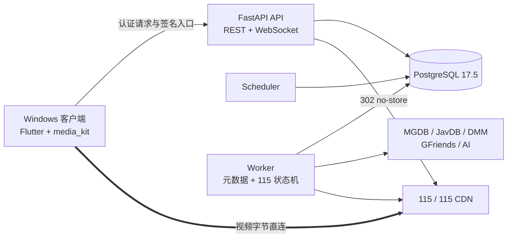

<div align="center">

# SakuraPlayer

Windows 私有媒体目录、115 缓存与流媒体播放客户端

[](LICENSE)
[](https://github.com/graysui/SakuraPlayer/actions/workflows/verify.yml)
[](https://github.com/graysui/SakuraPlayer/releases)
[](https://hub.docker.com/r/graysui/sakuraplayer-backend)


Windows 客户端负责浏览和播放，私有 Docker 后端负责目录、元数据、任务和账号安全。视频数据经签名入口直连 115/CDN，不经过 SakuraPlayer 后端转发。

[下载 Windows 客户端](https://github.com/graysui/SakuraPlayer/releases/latest) · [Linux 部署](#1-linux-docker-compose-部署推荐) · [首次使用](#3-连接并初始化) · [功能](#核心能力) · [架构](#项目架构)

</div>

> [!IMPORTANT]
> SakuraPlayer 不附带媒体资源、磁力内容或默认 MGDB 数据源。首次运行需要管理员自行配置合法的 MGDB GitHub Release 仓库，并自行承担第三方服务账号、内容来源和当地法律合规责任。

## 从这里开始

SakuraPlayer 由两个部分组成，普通用户需要同时准备后端和 Windows 客户端：

| 部分 | 安装位置 | 用途 |
|---|---|---|
| SakuraPlayer 后端 | Linux 服务器、NAS 或 Windows Docker Desktop | 保存目录、图片、任务、设置和加密凭据 |
| SakuraPlayer Windows 客户端 | Windows 10/11 x64 电脑 | 浏览媒体库、管理缓存和播放视频 |

推荐顺序：先在 Linux/NAS 上部署后端，再从 [GitHub Releases](https://github.com/graysui/SakuraPlayer/releases/latest) 下载 Windows 客户端，最后在客户端中填写后端地址并创建管理员。

> [!NOTE]
> Windows 发布物是一个 ZIP，里面包含 `sakuraplayer_windows.exe`、运行库和当前用户安装脚本。当前版本不是单文件 EXE 或 MSI 安装器，不需要管理员权限。

## 当前版本

| 组成 | 状态 | 说明 |
|---|---|---|
| Docker 后端 | 已完成 | FastAPI、PostgreSQL、Scheduler、Worker 与显式 Alembic 迁移 |
| Windows 客户端 | v1.0.0 | Windows 10/11、Flutter、media_kit/libmpv、ZIP + 当前用户安装脚本 |
| 真实 115 链路 | 已验证 | 扫码、离线、原画、HLS、Range seek、进度、租约与安全清理 |
| HarmonyOS 客户端 | 规划中 | API 24 工程与真机播放门禁尚未开始，不属于当前可用版本 |
| GitHub Release | v1.0.0 首发 | 自动构建 Windows x64 ZIP、GHCR/Docker Hub 后端镜像、SHA-256 与供应链证明 |

完整需求、任务状态和验证证据位于 [项目规格](docs/specs/001-sakuraplayer-v1/)；提交历史是最终实现事实。

## 核心能力

### 媒体目录与元数据

- 从管理员配置的 MGDB GitHub Release 数据源执行全量与增量同步。
- 媒体库、全局搜索、日/周/月/TOP250 排行榜、女优目录、收藏和影片详情。
- JavDB 核心元数据、DMM 简介、Actor Mapping、GFriends 图片以及可选 AI 中文翻译。
- 元数据任务支持暂停、继续、进度与失败数量展示，以及影片详情页单番号重新刮削。
- 封面、剧照等已验证图片保存到后端持久卷；第三方临时图片使用受限缓存。

### 115 缓存与播放

- Windows 客户端内完成 115 扫码绑定，Cookie 加密保存且不会通过设置接口回显。
- 后端持久离线队列，固定最多 2 个运行任务和 10 个排队任务。
- 自动识别主视频、连续分段和外置字幕；歧义结果由用户选择完整播放队列。
- 原画优先、最高码率 HLS 兼容模式、Range seek 合并、12 小时签名播放会话。
- 内嵌/外置字幕、音轨、倍速、全屏、跨客户端播放进度和自动续播。
- 可配置 TTL、固定 LRU 容量、播放租约保护和受管目录证明式清理。

### 私有部署与安全

- 唯一管理员、一次性初始化口令、Argon2id 密码和可撤销访问/刷新令牌。
- 115 Cookie、JavDB 凭据、AI key、MGDB 设置和磁力载荷均按职责隔离并加密保存。
- 默认仅发布到 `127.0.0.1:8000`；远程访问要求 HTTPS 或可信加密 VPN。
- REST 快照和版本化 WebSocket 事件共同恢复客户端状态，关键写入使用幂等或版本 CAS。
- 日志、错误响应、测试证据和发布包均执行敏感信息扫描。

## 项目架构



后端采用模块化单体，API、Scheduler 和 Worker 分进程运行；PostgreSQL 同时承担业务真相、任务队列和持久事件。详细设计见 [架构文档](docs/specs/architecture.md)。

## 安装与首次使用

### 1. Linux Docker Compose 部署（推荐）

准备一台安装了 Docker Engine、Docker Compose v2、OpenSSL 和 `flock`（Ubuntu/Debian 的 `util-linux` 包）的 Linux 服务器或 NAS。不需要安装 Python、Flutter 或数据库。

#### 下载并一键安装

从包含 Linux 部署资产的正式版本开始，打开 [SakuraPlayer Releases](https://github.com/graysui/SakuraPlayer/releases/latest)，下载同一版本的：

- `SakuraPlayer-Docker-X.Y.Z.tar.gz`
- `SakuraPlayer-Docker-X.Y.Z.tar.gz.sha256`

在下载目录执行：

```bash
sha256sum --check SakuraPlayer-Docker-*.tar.gz.sha256
tar -xzf SakuraPlayer-Docker-*.tar.gz
cd SakuraPlayer-Docker-*
./install.sh
```

安装脚本会自动生成五个独立的强随机 secret、创建发布版 `.env`、拉取固定版本镜像，并等待 PostgreSQL、迁移、API、Worker 和 Scheduler 健康。它不会在终端显示 secret，只会告诉你初始化口令文件的位置。重复执行 `./install.sh` 会复用原文件，不会重置数据库密码或加密密钥。

> [!NOTE]
> 已发布的 `v1.0.0` 早于一键部署包功能，因此该 Release 只有 Windows 资产。新版本发布前，可以从当前源码使用同一个安装器：

```bash
git clone --depth 1 https://github.com/graysui/SakuraPlayer.git
cd SakuraPlayer/backend
bash install.sh
```

`bootstrap_token.txt` 只在第一次创建管理员时使用。读取后请保存到密码管理器，不要发到聊天、日志或截图中；其余 secret 也不能提交到 Git。

#### 选择访问方式

默认 `.env` 只把 API 绑定到 Linux 本机的 `127.0.0.1:8000`，适合 HTTPS 反向代理。Windows 客户端与 Linux 服务器位于同一可信局域网时，可把 `.env` 中的地址改成服务器的实际私网 IP，例如：

```dotenv
SAKURAPLAYER_PUBLISH_HOST=192.168.1.50
SAKURAPLAYER_API_PORT=8000
```

请把 `192.168.1.50` 换成 Linux 服务器自己的地址，然后再次运行 `./install.sh` 应用配置。不要填写 `0.0.0.0`，也不要在路由器上把 8000 端口映射到公网；公网访问必须使用 HTTPS 反向代理或可信加密 VPN。

#### 查看初始化口令

```bash
cat secrets/bootstrap_token.txt
```

<details>
<summary><strong>高级：不使用安装脚本，手动准备 Compose</strong></summary>

手动路径保留给需要自定义部署的用户。先从 `.env.example` 创建 `.env` 并设置完整版本镜像，再以 `umask 077` 创建 `secrets/`，使用 OpenSSL 分别生成 32、32、48、48、48 字节的无填充 Base64URL 内容，对应以下文件：

```bash
secrets/postgres_password.txt
secrets/settings_key.txt
secrets/token_key.txt
secrets/playback_key.txt
secrets/bootstrap_token.txt
```

五个值必须彼此不同，文件权限为 `600`。准备完成后执行：

```bash
docker compose --env-file .env -p sakuraplayer config --quiet
docker compose --env-file .env -p sakuraplayer pull
docker compose --env-file .env -p sakuraplayer up -d --no-build --wait
```

</details>

### 2. 安装 Windows 客户端

1. 打开 [SakuraPlayer Releases](https://github.com/graysui/SakuraPlayer/releases/latest)。
2. 推荐下载 `SakuraPlayer-Windows-1.0.0-1-Setup.exe` 和同名 `.sha256` 文件；也可以下载 ZIP 手动安装包。
3. 在下载目录打开 PowerShell，校验文件未被篡改：

```powershell
$archive = '.\SakuraPlayer-Windows-1.0.0-1-Setup.exe'
$expected = (Get-Content "$archive.sha256").Split()[0].ToLowerInvariant()
$actual = (Get-FileHash $archive -Algorithm SHA256).Hash.ToLowerInvariant()
$actual -eq $expected
```

结果必须为 `True`。双击校验后的安装器，按向导安装即可；默认安装到当前用户的 `%LOCALAPPDATA%\Programs\SakuraPlayer`，不需要管理员权限。

如果选择 ZIP，解压后进入其中的 `SakuraPlayer` 文件夹，然后运行：

```powershell
Unblock-File .\Install-SakuraPlayer.ps1
.\Install-SakuraPlayer.ps1 -DesktopShortcut
```

应用会安装到当前用户的 `%LOCALAPPDATA%\Programs\SakuraPlayer`，并创建开始菜单快捷方式；使用 `-DesktopShortcut` 时也会创建桌面快捷方式，不需要管理员权限。

> [!IMPORTANT]
> 安装器是单文件下载包，内部仍包含 Flutter 应用所需的运行库和 `data` 目录；它不是可以脱离运行库直接复制的单二进制 EXE。公共构建没有 Authenticode 证书签名，请先完成 SHA-256 校验再运行安装器或安装脚本。

### 3. 连接并初始化

启动 SakuraPlayer，在服务端地址页填写：

| 部署方式 | 客户端地址示例 |
|---|---|
| Windows Docker Desktop 与客户端同机 | `http://127.0.0.1:8000/api/v1` |
| 家庭局域网 Linux 服务器 | `http://192.168.1.50:8000/api/v1` |
| HTTPS 反向代理 | `https://player.example.com/api/v1` |

局域网示例中的 IP 必须与 `.env` 的 `SAKURAPLAYER_PUBLISH_HOST` 一致。客户端测试连接成功后：

1. 使用 `bootstrap_token.txt` 的内容创建唯一管理员。
2. 在设置页填写你自己的 MGDB GitHub Release 仓库；未配置时不会同步媒体目录。
3. 按需配置 JavDB、AI 翻译和其他可选服务，并查看中文连接诊断。
4. 扫码绑定 115，等待目录与元数据同步后开始浏览和播放。

### 常用维护命令

在解压后的 Docker 部署目录或源码的 `SakuraPlayer/backend` 目录执行：

```bash
# 查看状态
docker compose --env-file .env -p sakuraplayer ps

# 查看后端日志
docker compose --env-file .env -p sakuraplayer logs -f api worker scheduler

# 拉取同版本镜像并重建容器，不删除数据库和图片
docker compose --env-file .env -p sakuraplayer pull
docker compose --env-file .env -p sakuraplayer up -d --no-build --wait

# 停止服务但保留数据卷
docker compose --env-file .env -p sakuraplayer down
```

不要执行 `docker compose down -v`，该参数会删除数据库、图片和缓存卷。v1 暂不提供自动备份，升级或迁移前请先备份 Docker volumes 和 `backend/secrets/`。

<details>
<summary><strong>在 Windows Docker Desktop 部署后端</strong></summary>

在仓库根目录打开 PowerShell：

```powershell
Set-Location backend
Copy-Item .env.example .env
$envText = (Get-Content -Raw .env).Replace(
    'SAKURAPLAYER_BACKEND_IMAGE=sakuraplayer-backend:local',
    'SAKURAPLAYER_BACKEND_IMAGE=docker.io/graysui/sakuraplayer-backend:1.0.0'
)
[IO.File]::WriteAllText(
    [IO.Path]::GetFullPath('.env'),
    $envText,
    (New-Object Text.UTF8Encoding($false))
)
New-Item -ItemType Directory -Force secrets | Out-Null

function Write-SakuraSecret([string]$path, [int]$byteCount) {
    $bytes = New-Object byte[] $byteCount
    $generator = [Security.Cryptography.RandomNumberGenerator]::Create()
    try {
        $generator.GetBytes($bytes)
    }
    finally {
        $generator.Dispose()
    }
    $value = [Convert]::ToBase64String($bytes).TrimEnd('=').Replace('+', '-').Replace('/', '_')
    [IO.File]::WriteAllText(
        [IO.Path]::GetFullPath($path),
        $value,
        (New-Object Text.UTF8Encoding($false))
    )
}

Write-SakuraSecret secrets/postgres_password.txt 32
Write-SakuraSecret secrets/settings_key.txt 32
Write-SakuraSecret secrets/token_key.txt 48
Write-SakuraSecret secrets/playback_key.txt 48
Write-SakuraSecret secrets/bootstrap_token.txt 48

docker compose --env-file .env -p sakuraplayer pull
docker compose --env-file .env -p sakuraplayer up -d --no-build --wait
Invoke-WebRequest http://127.0.0.1:8000/health/ready
```

</details>

<details>
<summary><strong>从源码构建</strong></summary>

从当前源码构建后端：

```bash
cd SakuraPlayer/backend
docker compose --env-file .env -p sakuraplayer up -d --build --wait
```

构建 Windows 私有发布包需要 Windows 10/11 x64、Flutter 3.29.2、Dart 3.7.2 和 Visual Studio Build Tools 2022：

```powershell
Set-Location windows
flutter pub get
.\tool\build_private_release.ps1
# 已安装 Inno Setup 6.4.2 后，再生成单文件当前用户安装器
.\tool\build_windows_installer.ps1 -SkipBuild -InnoSetupPath 'C:\Program Files (x86)\Inno Setup 6\ISCC.exe'
```

输出位于 `windows/dist/`，包含 ZIP、单文件安装器 EXE 及各自的 SHA-256 文件。

</details>

## 发布与校验

- pull request 与 `main` push 只执行离线验证，不发布制品，也不读取 115、JavDB、AI 或其他业务凭据。
- `vX.Y.Z` tag 必须与 `windows/pubspec.yaml` 的主版本一致；Windows build number 进入 ZIP 文件名。
- 同一次构建把后端镜像发布到 `ghcr.io/graysui/sakuraplayer-backend` 和 `docker.io/graysui/sakuraplayer-backend`，两处提供完整版本、major/minor、major、`latest` 和 Git SHA 标签并共享 digest。部署时推荐固定 digest 或完整版本。
- Windows ZIP、校验文件以及两个 registry 的后端镜像 digest 都生成 GitHub artifact attestation；Release 只在 Windows 与 Docker 两条构建均成功后创建。
- 所有工作流 Action 固定到完整 Git commit；GitHub 操作使用仓库 `GITHUB_TOKEN`，Docker Hub 使用专用 `DOCKERHUB_TOKEN` Actions Secret 和 job 级最小权限，不需要个人 GitHub PAT 或业务 secret。

正式发布契约见 [github-release.md](docs/specs/001-sakuraplayer-v1/contracts/github-release.md)。首个 GHCR 包生成后，仓库维护者需要在 GitHub Packages 中确认其可见性为 Public；Docker Hub 目标仓库也必须事先存在并允许 `DOCKERHUB_TOKEN` 写入，推荐设为 Public。这些是账户级设置，不由应用配置写入工作流。

## MGDB 与外部服务

| 服务 | 是否必需 | 用途与边界 |
|---|---|---|
| MGDB | 目录同步必需 | 用户自行提供 GitHub HTTPS 仓库地址；仓库需发布兼容的加密 Release 资产 |
| JavDB | 核心元数据建议配置 | 精确番号元数据与排行榜；账号凭据加密保存 |
| DMM | 可选 | 日文简介富化；上游不可用不阻塞核心影片可见性 |
| Actor Mapping / GFriends | 可选公共源 | 女优别名、头像与剧照；仅接受项目固定的 HTTPS 来源 |
| OpenAI-compatible AI | 可选 | 简介中文翻译；支持标准兼容接口和硅基流动 Qwen3.5 profile |
| 115 | 播放必需 | 扫码绑定、离线缓存、原画/HLS 和字幕下载 |

所有外部接口都可能因网络、限流、登录状态或上游协议变化而不可用。SakuraPlayer 会区分“未配置”“凭据失效”和“上游不可用”，但不承诺第三方服务持续可访问。

## 开发与验证

后端和 Windows 客户端均提供默认离线验证，不会访问真实 115、JavDB 写操作或付费 AI：

```powershell
# 仓库根目录
windows\tool\run_default_tests.ps1
```

Windows 单独验证：

```powershell
Set-Location windows
flutter analyze
flutter test
```

开发热更新说明见 [development-hot-reload.md](docs/development-hot-reload.md)。完整的 Focused、Fast 和 Final 门禁见 [实施与验证工作流](docs/specs/001-sakuraplayer-v1/implementation-workflow.md)。真实 115 测试只能通过显式开关和专属受管目录运行。

## 仓库结构

```text
backend/    FastAPI、PostgreSQL 迁移、Scheduler、Worker、Docker Compose
windows/    Flutter Windows 客户端、测试、私有 Release 构建工具
docs/       架构、规格、契约、任务与追踪矩阵
LICENSE     GPL-3.0-only 完整许可证
```

## 安全与隐私

- 不要提交 `backend/secrets/`、`.env`、115 Cookie、密码、API key、磁力、二维码或完整签名 URL。
- 默认 Compose 只监听 loopback。跨设备使用时应通过 HTTPS 反向代理或可信 VPN，不要把 HTTP API 直接暴露到公网。
- v1 不提供自动数据库或图片备份；升级、迁移或清理前应自行备份 Docker volumes。
- 115、JavDB、DMM、GFriends、GitHub 数据源和 AI 服务均为独立第三方，SakuraPlayer 与其无隶属或授权关系。
- 本项目面向成年人进行私有部署。用户必须确保其账号、数据源、缓存和播放行为符合服务条款、版权要求及所在地法律。

## 路线图

- Windows v1 与真实 115 主链路已完成并通过发布门禁。
- 当前优先完善公开发布材料、可复现安装说明和首个 GitHub Release。
- HarmonyOS API 24 客户端仍处于规划阶段；须先完成 Stage 工程和真机播放探针，不能使用当前 README 中的 Windows 状态推断其可用性。

## 参考与致谢

SakuraPlayer 在设计和实现过程中参考了以下 GPLv3 项目：

- [SakuraMedia](https://github.com/tinypinglite/sakuramedia)：参考 feature-first 组织方式、桌面信息架构和节流播放行为；SakuraPlayer Windows 客户端未直接复制其应用源码。
- [SakuraMedia Backend](https://github.com/tinypinglite/sakuramediabe)：在固定 revision `670ca75b2d35b606ffc0caa6fd47fd04c4c95870` 上，选择性适配 Cloud115 协议行为、downurl RSA/XOR 辅助逻辑、JavDB 签名 JSON 请求形态和 DMM 请求兼容方式。

精确的上游文件、保留符号和排除范围记录在 [第三方声明](THIRD_PARTY_NOTICES.md) 与 [Cloud115 来源声明](backend/src/sakuraplayer/cloud_cache/infrastructure/cloud115/NOTICE.md)。此外，项目使用 [media_kit](https://github.com/media-kit/media-kit)、[Jav-Actors-Mapping](https://github.com/li-peifeng/Jav-Actors-Mapping) 和 [gfriends](https://github.com/li-peifeng/gfriends)；完整版本与许可证信息随 Windows 发布包提供。

## 许可证

SakuraPlayer 采用 [GNU General Public License v3.0 only](LICENSE)。分发源码或二进制时，必须同时保留适用的 GPL 文本、第三方声明和复用来源说明。
