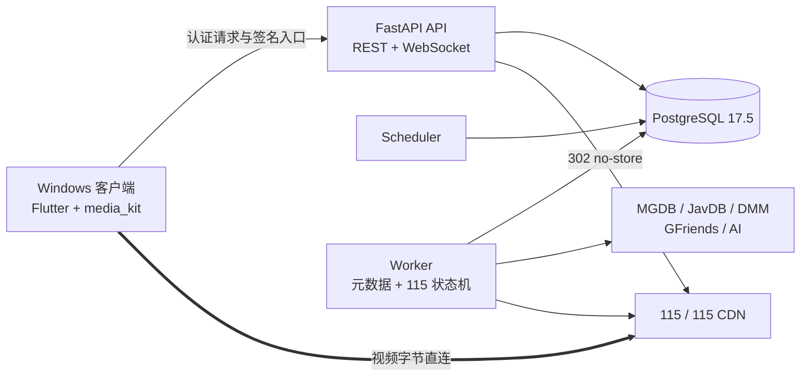

<div align="center">

# SakuraPlayer

面向 Windows 的私有媒体目录、115 缓存与流媒体播放系统

[](LICENSE)
[](https://github.com/graysui/SakuraPlayer/actions/workflows/verify.yml)
[](https://github.com/graysui/SakuraPlayer/releases)


单管理员、单 115 账号、默认仅本机开放。目录与任务状态由后端持久化，视频数据经签名入口重定向至 115/CDN，不经过 SakuraPlayer 后端转发。

[快速开始](#快速开始) · [发布与校验](#发布与校验) · [项目架构](#项目架构) · [参考与致谢](#参考与致谢)

</div>

> [!IMPORTANT]
> SakuraPlayer 不附带媒体资源、磁力内容或默认 MGDB 数据源。首次运行需要管理员自行配置合法的 MGDB GitHub Release 仓库，并自行承担第三方服务账号、内容来源和当地法律合规责任。

## 当前状态

| 组成 | 状态 | 说明 |
|---|---|---|
| Docker 后端 | 已完成 | FastAPI、PostgreSQL、Scheduler、Worker 与显式 Alembic 迁移 |
| Windows 客户端 | v1 已完成 | Windows 10/11、Flutter、media_kit/libmpv、私有 ZIP 安装包 |
| 真实 115 链路 | 已验证 | 扫码、离线、原画、HLS、Range seek、进度、租约与安全清理 |
| HarmonyOS 客户端 | 规划中 | API 24 工程与真机播放门禁尚未开始，不属于当前可用版本 |
| GitHub Release | 自动化已就绪 | 严格版本 tag 自动构建 Windows x64 ZIP、GHCR/Docker Hub 后端镜像、SHA-256 与供应链证明 |

README 当前覆盖至 TASK-316。近期功能提交中已经交付：

| 提交 | 交付内容 |
|---|---|
| `daef542` | TASK-315：MGDB 改为用户配置的 GitHub 数据源；未配置时不联网，不再内置第三方仓库 |
| `c6cde11` | 完成 Windows 客户端代码清理和 Release 内容审计 |
| `7d377d1` | 详情页只显示中文简介，并支持当前番号最高优先级重新刮削 |
| `f2ed89d` | 改进 115 离线任务确认速度与协议状态兼容 |
| `d793139` | 完善硅基流动 Qwen3.5 翻译请求、输出约束和脱敏诊断 |

完整需求、任务状态和验证证据位于 [项目规格](docs/specs/001-sakuraplayer-v1/)；提交历史是最终实现事实。

## 核心能力

### 媒体目录与元数据

- 从管理员配置的 MGDB GitHub Release 数据源执行全量与增量同步。
- 媒体库、全局搜索、日/周/月/TOP250 排行榜、女优目录、收藏和影片详情。
- JavDB 核心元数据、DMM 简介、Actor Mapping、GFriends 图片以及可选 AI 中文翻译。
- 元数据任务支持暂停、继续、进度与失败数量展示，以及影片详情页单番号重新刮削。
- 封面、剧照等已验证图片保存到后端持久卷；第三方临时图片使用受限缓存。

### 115 缓存与播放

- Windows 客户端内完成 115 扫码绑定，Cookie 加密保存且不会通过设置接口回显。
- 后端持久离线队列，固定最多 2 个运行任务和 10 个排队任务。
- 自动识别主视频、连续分段和外置字幕；歧义结果由用户选择完整播放队列。
- 原画优先、最高码率 HLS 兼容模式、Range seek 合并、12 小时签名播放会话。
- 内嵌/外置字幕、音轨、倍速、全屏、跨客户端播放进度和自动续播。
- 可配置 TTL、固定 LRU 容量、播放租约保护和受管目录证明式清理。

### 私有部署与安全

- 唯一管理员、一次性初始化口令、Argon2id 密码和可撤销访问/刷新令牌。
- 115 Cookie、JavDB 凭据、AI key、MGDB 设置和磁力载荷均按职责隔离并加密保存。
- 默认仅发布到 `127.0.0.1:8000`；远程访问要求 HTTPS 或可信加密 VPN。
- REST 快照和版本化 WebSocket 事件共同恢复客户端状态，关键写入使用幂等或版本 CAS。
- 日志、错误响应、测试证据和发布包均执行敏感信息扫描。

## 项目架构



后端采用模块化单体，API、Scheduler 和 Worker 分进程运行；PostgreSQL 同时承担业务真相、任务队列和持久事件。详细设计见 [架构文档](docs/specs/architecture.md)。

## 首次使用流程

1. 准备 Docker 后端所需的五个互不复用的 secret，并启动 Compose。
2. 构建或安装 Windows 客户端，填写 `http://127.0.0.1:8000/api/v1`。
3. 使用 bootstrap token 创建唯一管理员；初始化完成后该 token 永久失去创建管理员的权限。
4. 在设置页填写 MGDB GitHub 仓库地址。没有 MGDB 配置时，同步不会发起网络请求。
5. 按需配置 JavDB 和 OpenAI-compatible AI 服务，并查看连接诊断。
6. 扫码绑定 115，等待目录与元数据同步后开始浏览和播放。

## 快速开始

### 环境要求

- Windows 10 或 Windows 11 x64。
- Docker Engine 与 Docker Compose；项目验证基线分别为 28.2.2 和 2.37.1。
- 从源码构建客户端时需要 Flutter 3.29.2、Dart 3.7.2，以及含桌面 C++ 工具链的 Visual Studio Build Tools 2022。

### 1. 准备后端配置

在仓库根目录打开 PowerShell：

```powershell
Set-Location backend
Copy-Item .env.example .env
New-Item -ItemType Directory -Force secrets | Out-Null

function New-SakuraSecret([int]$byteCount) {
    $buffer = New-Object byte[] $byteCount
    $generator = [System.Security.Cryptography.RandomNumberGenerator]::Create()
    try {
        $generator.GetBytes($buffer)
    }
    finally {
        $generator.Dispose()
    }
    [Convert]::ToBase64String($buffer).TrimEnd('=').Replace('+', '-').Replace('/', '_')
}

$utf8NoBom = New-Object System.Text.UTF8Encoding($false)
function Write-SakuraSecret([string]$path, [int]$byteCount) {
    [IO.File]::WriteAllText(
        [IO.Path]::GetFullPath($path),
        (New-SakuraSecret $byteCount),
        $utf8NoBom
    )
}

Write-SakuraSecret secrets/postgres_password.txt 32
Write-SakuraSecret secrets/settings_key.txt 32
Write-SakuraSecret secrets/token_key.txt 48
Write-SakuraSecret secrets/playback_key.txt 48
Write-SakuraSecret secrets/bootstrap_token.txt 48
```

`backend/secrets/` 已被 Git 忽略。请另行安全保存 `bootstrap_token.txt` 的内容，首次创建管理员时需要输入；不要把任何 secret 提交到仓库或发送到日志。

### 2. 启动后端

正式版本发布后，可使用与 Release tag 一致的 GHCR 或 Docker Hub 镜像。四个后端进程会复用同一个镜像，以下示例使用 Docker Hub：

```powershell
$env:SAKURAPLAYER_BACKEND_IMAGE = 'docker.io/graysui/sakuraplayer-backend:1.0.0'
docker compose --env-file .env -p sakuraplayer pull postgres api migrate worker scheduler
docker compose --env-file .env -p sakuraplayer up -d --no-build --wait
docker compose --env-file .env -p sakuraplayer ps
Invoke-WebRequest http://127.0.0.1:8000/health/ready
```

从当前源码构建后端：

```powershell
docker compose --env-file .env -p sakuraplayer up -d --build --wait
docker compose --env-file .env -p sakuraplayer ps
Invoke-WebRequest http://127.0.0.1:8000/health/ready
```

停止服务但保留数据库和图片卷：

```powershell
docker compose --env-file .env -p sakuraplayer down
```

部署到其他设备可访问的网络前，请先阅读 [运行配置契约](docs/specs/001-sakuraplayer-v1/contracts/runtime-configuration.md)。项目不提供明文公网部署方案。

### 3. 安装 Windows 客户端

正式版本发布后，可使用 GitHub CLI 下载 Windows ZIP 和同名 SHA-256 文件：

```powershell
Set-Location ..
New-Item -ItemType Directory -Force release | Out-Null
gh release download v1.0.0 --repo graysui/SakuraPlayer --pattern 'SakuraPlayer-Windows-*.zip*' --dir release
Get-FileHash .\release\SakuraPlayer-Windows-1.0.0-1.zip -Algorithm SHA256
Get-Content .\release\SakuraPlayer-Windows-1.0.0-1.zip.sha256
```

确认两处 SHA-256 相同后解压 ZIP，以目标桌面用户运行 `Install-SakuraPlayer.ps1`，无需管理员权限。公共 CI 产物没有 Authenticode 证书签名；GitHub artifact attestation 用于证明构建来源，不能替代 Windows 代码签名。

从源码构建 Windows 私有安装包：

```powershell
Set-Location windows
flutter pub get
.\tool\build_private_release.ps1
```

构建工具会执行 Windows Release 构建，并验证 `sakuraplayer_windows.exe`、Flutter/libmpv 原生文件、GPL/第三方声明、安装脚本和完整 SHA-256 清单。输出位于 `windows/dist/`。

## 发布与校验

- pull request 与 `main` push 只执行离线验证，不发布制品，也不读取 115、JavDB、AI 或其他业务凭据。
- `vX.Y.Z` tag 必须与 `windows/pubspec.yaml` 的主版本一致；Windows build number 进入 ZIP 文件名。
- 同一次构建把后端镜像发布到 `ghcr.io/graysui/sakuraplayer-backend` 和 `docker.io/graysui/sakuraplayer-backend`，两处提供完整版本、major/minor、major、`latest` 和 Git SHA 标签并共享 digest。部署时推荐固定 digest 或完整版本。
- Windows ZIP、校验文件以及两个 registry 的后端镜像 digest 都生成 GitHub artifact attestation；Release 只在 Windows 与 Docker 两条构建均成功后创建。
- 所有工作流 Action 固定到完整 Git commit；GitHub 操作使用仓库 `GITHUB_TOKEN`，Docker Hub 使用专用 `DOCKERHUB_TOKEN` Actions Secret 和 job 级最小权限，不需要个人 GitHub PAT 或业务 secret。

正式发布契约见 [github-release.md](docs/specs/001-sakuraplayer-v1/contracts/github-release.md)。首个 GHCR 包生成后，仓库维护者需要在 GitHub Packages 中确认其可见性为 Public；Docker Hub 目标仓库也必须事先存在并允许 `DOCKERHUB_TOKEN` 写入，推荐设为 Public。这些是账户级设置，不由应用配置写入工作流。

## MGDB 与外部服务

| 服务 | 是否必需 | 用途与边界 |
|---|---|---|
| MGDB | 目录同步必需 | 用户自行提供 GitHub HTTPS 仓库地址；仓库需发布兼容的加密 Release 资产 |
| JavDB | 核心元数据建议配置 | 精确番号元数据与排行榜；账号凭据加密保存 |
| DMM | 可选 | 日文简介富化；上游不可用不阻塞核心影片可见性 |
| Actor Mapping / GFriends | 可选公共源 | 女优别名、头像与剧照；仅接受项目固定的 HTTPS 来源 |
| OpenAI-compatible AI | 可选 | 简介中文翻译；支持标准兼容接口和硅基流动 Qwen3.5 profile |
| 115 | 播放必需 | 扫码绑定、离线缓存、原画/HLS 和字幕下载 |

所有外部接口都可能因网络、限流、登录状态或上游协议变化而不可用。SakuraPlayer 会区分“未配置”“凭据失效”和“上游不可用”，但不承诺第三方服务持续可访问。

## 开发与验证

后端和 Windows 客户端均提供默认离线验证，不会访问真实 115、JavDB 写操作或付费 AI：

```powershell
# 仓库根目录
windows\tool\run_default_tests.ps1
```

Windows 单独验证：

```powershell
Set-Location windows
flutter analyze
flutter test
```

开发热更新说明见 [development-hot-reload.md](docs/development-hot-reload.md)。完整的 Focused、Fast 和 Final 门禁见 [实施与验证工作流](docs/specs/001-sakuraplayer-v1/implementation-workflow.md)。真实 115 测试只能通过显式开关和专属受管目录运行。

## 仓库结构

```text
backend/    FastAPI、PostgreSQL 迁移、Scheduler、Worker、Docker Compose
windows/    Flutter Windows 客户端、测试、私有 Release 构建工具
docs/       架构、规格、契约、任务与追踪矩阵
LICENSE     GPL-3.0-only 完整许可证
```

## 安全与隐私

- 不要提交 `backend/secrets/`、`.env`、115 Cookie、密码、API key、磁力、二维码或完整签名 URL。
- 默认 Compose 只监听 loopback。跨设备使用时应通过 HTTPS 反向代理或可信 VPN，不要把 HTTP API 直接暴露到公网。
- v1 不提供自动数据库或图片备份；升级、迁移或清理前应自行备份 Docker volumes。
- 115、JavDB、DMM、GFriends、GitHub 数据源和 AI 服务均为独立第三方，SakuraPlayer 与其无隶属或授权关系。
- 本项目面向成年人进行私有部署。用户必须确保其账号、数据源、缓存和播放行为符合服务条款、版权要求及所在地法律。

## 路线图

- Windows v1 与真实 115 主链路已完成并通过发布门禁。
- 当前优先完善公开发布材料、可复现安装说明和首个 GitHub Release。
- HarmonyOS API 24 客户端仍处于规划阶段；须先完成 Stage 工程和真机播放探针，不能使用当前 README 中的 Windows 状态推断其可用性。

## 参考与致谢

SakuraPlayer 在设计和实现过程中参考了以下 GPLv3 项目：

- [SakuraMedia](https://github.com/tinypinglite/sakuramedia)：参考 feature-first 组织方式、桌面信息架构和节流播放行为；SakuraPlayer Windows 客户端未直接复制其应用源码。
- [SakuraMedia Backend](https://github.com/tinypinglite/sakuramediabe)：在固定 revision `670ca75b2d35b606ffc0caa6fd47fd04c4c95870` 上，选择性适配 Cloud115 协议行为、downurl RSA/XOR 辅助逻辑、JavDB 签名 JSON 请求形态和 DMM 请求兼容方式。

精确的上游文件、保留符号和排除范围记录在 [第三方声明](THIRD_PARTY_NOTICES.md) 与 [Cloud115 来源声明](backend/src/sakuraplayer/cloud_cache/infrastructure/cloud115/NOTICE.md)。此外，项目使用 [media_kit](https://github.com/media-kit/media-kit)、[Jav-Actors-Mapping](https://github.com/li-peifeng/Jav-Actors-Mapping) 和 [gfriends](https://github.com/li-peifeng/gfriends)；完整版本与许可证信息随 Windows 发布包提供。

## 许可证

SakuraPlayer 采用 [GNU General Public License v3.0 only](LICENSE)。分发源码或二进制时，必须同时保留适用的 GPL 文本、第三方声明和复用来源说明。
