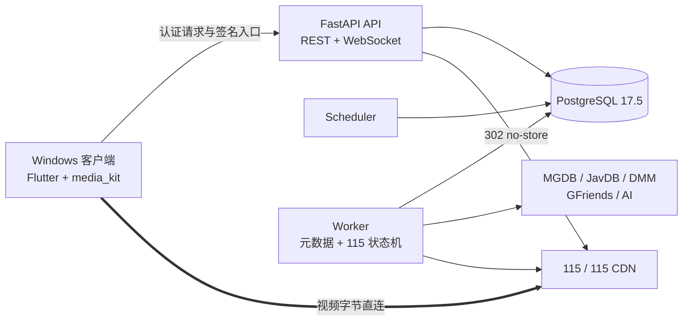

<div align="center">


# SakuraPlayer

**自己搭建的私人影视库：Windows 播放器 + 私有后端，浏览、缓存、播放一条龙**

[](LICENSE)
[](https://github.com/graysui/SakuraPlayer/releases)
[](https://hub.docker.com/r/graysui/sakuraplayer-backend)


[下载 Windows 客户端](https://github.com/graysui/SakuraPlayer/releases/latest) · [三步上手](#-三步上手) · [常见问题](#-常见问题) · [安全与隐私](#-安全与隐私) · [许可证](#-许可证)

</div>

> [!IMPORTANT]
> SakuraPlayer 不附带媒体资源、磁力内容或默认 MGDB 数据源。首次运行需要管理员自行配置合法的 MGDB GitHub Release 仓库，并自行承担第三方服务账号、内容来源和当地法律合规责任。

## 🚀 SakuraPlayer 是什么？

SakuraPlayer 由两个部分组成，**普通用户需要同时准备后端和 Windows 客户端**：

| 部分 | 装在哪里 | 负责什么 |
|---|---|---|
| **后端** | Linux 服务器 / NAS / Windows 电脑上的 Docker | 保存媒体目录、图片、任务、设置和加密凭据 |
| **Windows 客户端** | 你的 Windows 10/11 电脑 | 浏览媒体库、管理缓存、播放视频 |

播放时，视频数据从 115/CDN **直连**你的电脑，不经过后端转发——速度快，后端也看不到你的播放内容。

<details>
<summary>📐 一张图看懂工作原理（点开查看）</summary>



后端采用模块化单体，API、Scheduler 和 Worker 分进程运行；PostgreSQL 同时承担业务真相、任务队列和持久事件。详细设计见 [架构文档](docs/specs/architecture.md)。

</details>

## ✨ 核心功能

### 🎬 媒体库与元数据

- 自动同步你配置的 MGDB 数据源，支持全量与增量更新。
- 媒体库、全局搜索、日/周/月/TOP250 排行榜、女优目录、收藏和影片详情。
- 自动抓取 JavDB 核心元数据、DMM 简介、女优头像与剧照，可选 AI 中文翻译。
- 单个影片可随时重新刮削；元数据任务支持暂停、继续，进度和失败数量一目了然。
- 封面、剧照保存在后端；第三方临时图片使用受限缓存。

### ☁️ 115 缓存与播放

- Windows 客户端内扫码绑定 115，Cookie 加密保存、不会通过设置接口回显。
- 自动识别主视频、连续分段和外置字幕；歧义时由你选择完整播放队列。
- 原画优先、最高码率 HLS 兼容模式、Range seek 合并、12 小时签名播放会话。
- 内嵌/外置字幕、音轨、倍速、全屏、跨客户端播放进度和自动续播。
- 缓存支持可配置 TTL 和固定 LRU 容量，受管目录证明式安全清理。

### 🔒 私有部署与安全

- 唯一管理员、一次性初始化口令、Argon2id 密码和可撤销访问/刷新令牌。
- 115 Cookie、JavDB 凭据、AI key、MGDB 设置等按职责隔离并加密保存。
- 默认仅发布到 `127.0.0.1:8000`；远程访问要求 HTTPS 或可信加密 VPN。
- 日志、错误响应、测试证据和发布包均执行敏感信息扫描。

## 📦 三步上手

### 第 1 步：准备后端（推荐：Linux 一键安装）

准备一台安装了 Docker 的 Linux 服务器或 NAS（不需要安装 Python、Flutter 或数据库）。复制下面这一行执行即可：它会自动找到最新正式 Release、下载对应的 Linux Docker 部署包、临时解压并启动服务，不需要手动下载、解压或校验：

```bash
cd /vol1/1000/docker/Sakuraplayer   # 换成你自己喜欢的目录
curl -fsSL https://raw.githubusercontent.com/graysui/SakuraPlayer/main/backend/install-latest.sh | bash
```

- 脚本自动生成五个独立的强随机 secret、创建 `.env`、拉取固定版本镜像，并等待数据库、API、Worker 和 Scheduler 全部健康。
- 数据库、图片、缓存和日志保存在当前目录的 `data/` 子目录，不会落到 Docker 系统卷目录。
- secret 不会显示在终端，只会告诉你初始化口令文件的位置。
- 首次运行会询问 `SAKURAPLAYER_PUBLISH_HOST` 与 `SAKURAPLAYER_API_PORT`，直接回车使用 `127.0.0.1:8000`。
- 之后重复执行同一条命令即可原地升级：只更新镜像版本，保留地址、端口、代理等配置，不会重置数据库密码、加密密钥或已刮削数据。

**选择访问方式**

默认绑定 Linux 本机 `127.0.0.1:8000`，适合 HTTPS 反向代理。如果 Windows 客户端与 Linux 服务器位于同一可信局域网，首次安装时也可以直接填写服务器私网 IP 和端口：

```dotenv
SAKURAPLAYER_PUBLISH_HOST=192.168.1.50
SAKURAPLAYER_API_PORT=8000
```

请把 `192.168.1.50` 换成 Linux 服务器自己的地址。不要填写 `0.0.0.0`，也不要在路由器上把 8000 端口映射到公网；公网访问必须使用 HTTPS 反向代理或可信加密 VPN。

**查看初始化口令**（只在第一次创建管理员时使用）

```bash
cat secrets/bootstrap_token.txt
```

读取后请保存到密码管理器，不要发到聊天、日志或截图中。

> [!NOTE]
> 一键安装需要 Linux 主机预装 Docker Engine、Docker Compose v2、curl、OpenSSL 和 `flock`（Ubuntu/Debian 的 `util-linux` 包）。如果需要对发布资产做人工审查或离线部署，也可以从 [SakuraPlayer Releases](https://github.com/graysui/SakuraPlayer/releases/latest) 手动下载归档，使用同目录的 `./install.sh`。

<details>
<summary>🪟 没有 Linux？可以在 Windows Docker Desktop 上装后端</summary>

在仓库根目录打开 PowerShell：

```powershell
Set-Location backend
Copy-Item .env.example .env
$envText = (Get-Content -Raw .env).Replace(
    'SAKURAPLAYER_BACKEND_IMAGE=sakuraplayer-backend:local',
    'SAKURAPLAYER_BACKEND_IMAGE=docker.io/graysui/sakuraplayer-backend:1.0.0'
)
[IO.File]::WriteAllText(
    [IO.Path]::GetFullPath('.env'),
    $envText,
    (New-Object Text.UTF8Encoding($false))
)
New-Item -ItemType Directory -Force secrets | Out-Null

function Write-SakuraSecret([string]$path, [int]$byteCount) {
    $bytes = New-Object byte[] $byteCount
    $generator = [Security.Cryptography.RandomNumberGenerator]::Create()
    try {
        $generator.GetBytes($bytes)
    }
    finally {
        $generator.Dispose()
    }
    $value = [Convert]::ToBase64String($bytes).TrimEnd('=').Replace('+', '-').Replace('/', '_')
    [IO.File]::WriteAllText(
        [IO.Path]::GetFullPath($path),
        $value,
        (New-Object Text.UTF8Encoding($false))
    )
}

Write-SakuraSecret secrets/postgres_password.txt 32
Write-SakuraSecret secrets/settings_key.txt 32
Write-SakuraSecret secrets/token_key.txt 48
Write-SakuraSecret secrets/playback_key.txt 48
Write-SakuraSecret secrets/bootstrap_token.txt 48

docker compose --env-file .env -p sakuraplayer pull
docker compose --env-file .env -p sakuraplayer up -d --no-build --wait
Invoke-WebRequest http://127.0.0.1:8000/health/ready
```

</details>

<details>
<summary>🧰 常用维护命令（点开查看）</summary>

在 Docker 部署目录（或源码的 `SakuraPlayer/backend` 目录）执行：

```bash
# 查看状态
docker compose --env-file .env -p sakuraplayer ps

# 查看后端日志
docker compose --env-file .env -p sakuraplayer logs -f api worker scheduler

# 拉取同版本镜像并重建容器，不删除数据库和图片
docker compose --env-file .env -p sakuraplayer pull
docker compose --env-file .env -p sakuraplayer up -d --no-build --wait

# 停止服务但保留数据卷
docker compose --env-file .env -p sakuraplayer down
```

升级或迁移前请先备份当前目录的 `data/`、`.env` 和 `secrets/`。未确认旧数据卷迁移完成前，不要执行 `docker compose down -v`，否则可能删除仍未迁移的旧数据卷。v1 暂不提供自动备份。

</details>

### 第 2 步：安装 Windows 客户端

1. 打开 [SakuraPlayer Releases](https://github.com/graysui/SakuraPlayer/releases/latest)。
2. 推荐下载 `SakuraPlayer-Windows-1.0.0-1-Setup.exe` 和同名 `.sha256` 文件；也可以下载 ZIP 手动安装包。
3. 在下载目录打开 PowerShell，校验文件未被篡改，结果必须为 `True`：

```powershell
$archive = '.\SakuraPlayer-Windows-1.0.0-1-Setup.exe'
$expected = (Get-Content "$archive.sha256").Split()[0].ToLowerInvariant()
$actual = (Get-FileHash $archive -Algorithm SHA256).Hash.ToLowerInvariant()
$actual -eq $expected
```

4. 双击校验后的安装器，按向导安装即可。默认安装到当前用户的 `%LOCALAPPDATA%\Programs\SakuraPlayer`，不需要管理员权限。

如果选择 ZIP：解压后进入其中的 `SakuraPlayer` 文件夹，运行：

```powershell
Unblock-File .\Install-SakuraPlayer.ps1
.\Install-SakuraPlayer.ps1 -DesktopShortcut
```

应用会安装到当前用户的 `%LOCALAPPDATA%\Programs\SakuraPlayer`，并创建开始菜单快捷方式；使用 `-DesktopShortcut` 时也会创建桌面快捷方式，不需要管理员权限。

> [!IMPORTANT]
> 安装器是单文件下载包，内部仍包含 Flutter 应用所需的运行库和 `data` 目录；它不是可以脱离运行库直接复制的单二进制 EXE。公共构建没有 Authenticode 证书签名，请先完成 SHA-256 校验再运行安装器或安装脚本。

### 第 3 步：连接并初始化

启动 SakuraPlayer，在服务端地址页填写：

| 部署方式 | 客户端地址示例 |
|---|---|
| Windows Docker Desktop 与客户端同机 | `http://127.0.0.1:8000/api/v1` |
| 家庭局域网 Linux 服务器 | `http://192.168.1.50:8000/api/v1` |
| HTTPS 反向代理 | `https://player.example.com/api/v1` |

局域网示例中的 IP 必须与一键安装时填写的 `SAKURAPLAYER_PUBLISH_HOST` 一致。客户端测试连接成功后：

1. 使用 `bootstrap_token.txt` 的内容创建唯一管理员。
2. 在设置页填写你自己的 MGDB GitHub Release 仓库；未配置时不会同步媒体目录。
3. 按需配置 JavDB、AI 翻译和其他可选服务，并查看中文连接诊断。
4. 扫码绑定 115，等待目录与元数据同步后开始浏览和播放。

## ❓ 常见问题

<details>
<summary>我需要准备什么才能用起来？</summary>

一台能跑 Docker 的服务器/NAS/旧电脑（或 Windows 上的 Docker Desktop）作为后端，一台 Windows 10/11 电脑运行客户端。具体步骤见上面的 [三步上手](#-三步上手)。

</details>

<details>
<summary>为什么一定要配置 MGDB？</summary>

MGDB 是媒体目录数据源。SakuraPlayer 不附带任何媒体资源，必须由你自己提供一个合法的 MGDB GitHub Release 仓库，配置后才会同步媒体目录。

</details>

<details>
<summary>必须绑定 115 吗？</summary>

播放必需。扫码绑定 115 后才能缓存、原画/HLS 播放和下载字幕；Cookie 加密保存，不会通过设置接口回显。

</details>

<details>
<summary>后端和客户端必须放在同一台电脑吗？</summary>

不用。只要网络可达即可：同一台电脑、同一可信局域网或通过 HTTPS 反向代理都行。

</details>

<details>
<summary>手机能看吗？</summary>

HarmonyOS 客户端目前仍在规划中，当前可用的是 Windows 客户端。

</details>

<details>
<summary>我的数据安全吗？</summary>

凭据加密保存、默认仅监听本机、视频直连不经后端转发。公网访问必须走 HTTPS 或可信 VPN，详见 [安全与隐私](#-安全与隐私)。

</details>

<details>
<summary>📌 外部服务一览</summary>

| 服务 | 是否必需 | 用途与边界 |
|---|---|---|
| MGDB | 目录同步必需 | 用户自行提供 GitHub HTTPS 仓库地址；仓库需发布兼容的加密 Release 资产 |
| JavDB | 核心元数据建议配置 | 精确番号元数据与排行榜；账号凭据加密保存 |
| DMM | 可选 | 日文简介富化；上游不可用不阻塞核心影片可见性 |
| Actor Mapping / GFriends | 可选公共源 | 女优别名、头像与剧照；仅接受项目固定的 HTTPS 来源 |
| OpenAI-compatible AI | 可选 | 简介中文翻译；支持标准兼容接口和硅基流动 Qwen3.5 profile |
| 115 | 播放必需 | 扫码绑定、离线缓存、原画/HLS 和字幕下载 |

所有外部接口都可能因网络、限流、登录状态或上游协议变化而不可用。SakuraPlayer 会区分「未配置」「凭据失效」和「上游不可用」，但不承诺第三方服务持续可访问。

</details>

<details>
<summary>📌 当前版本状态</summary>

| 组成 | 状态 | 说明 |
|---|---|---|
| Docker 后端 | 已完成 | FastAPI、PostgreSQL、Scheduler、Worker 与显式 Alembic 迁移 |
| Windows 客户端 | 可用 | Windows 10/11、Flutter、media_kit/libmpv、ZIP + 当前用户安装脚本 |
| 真实 115 链路 | 已验证 | 扫码、离线、原画、HLS、Range seek、进度、租约与安全清理 |
| HarmonyOS 客户端 | 规划中 | API 24 工程与 SDK/构建/fixture 基线尚未开始，不属于当前可用版本 |
| GitHub Release | 已首发 | 自动构建 Windows x64 ZIP、GHCR/Docker Hub 后端镜像、SHA-256 与供应链证明 |

完整需求、任务状态和验证证据位于 [项目规格](docs/specs/001-sakuraplayer-v1/)；提交历史是最终实现事实。

</details>

## 🔐 安全与隐私

- 不要提交 `backend/secrets/`、`.env`、115 Cookie、密码、API key、磁力、二维码或完整签名 URL。
- 默认 Compose 只监听 loopback。跨设备使用时应通过 HTTPS 反向代理或可信 VPN，不要把 HTTP API 直接暴露到公网。
- v1 不提供自动数据库或图片备份；升级、迁移或清理前应自行备份部署目录的 `data/`、`.env` 和 `secrets/`。
- 115、JavDB、DMM、GFriends、GitHub 数据源和 AI 服务均为独立第三方，SakuraPlayer 与其无隶属或授权关系。
- 本项目面向成年人进行私有部署。用户必须确保其账号、数据源、缓存和播放行为符合服务条款、版权要求及所在地法律。

## 🧭 路线图

- Windows v1 与真实 115 主链路已完成并通过发布门禁。
- 当前优先完善公开发布材料、可复现安装说明和后续 GitHub Release。
- HarmonyOS API 24 客户端仍处于规划阶段；须先完成 Stage 工程和 API 24 SDK/构建/fixture 兼容性验证，不能使用当前 README 中的 Windows 状态推断其可用性；不要求连接 API 24 物理真机。

## 📚 参考与致谢

SakuraPlayer 在设计和实现过程中参考了以下 GPLv3 项目：

- [SakuraMedia](https://github.com/tinypinglite/sakuramedia)：参考 feature-first 组织方式、桌面信息架构和节流播放行为；SakuraPlayer Windows 客户端未直接复制其应用源码。
- [SakuraMedia Backend](https://github.com/tinypinglite/sakuramediabe)：在固定 revision `670ca75b2d35b606ffc0caa6fd47fd04c4c95870` 上，选择性适配 Cloud115 协议行为、downurl RSA/XOR 辅助逻辑、JavDB 签名 JSON 请求形态和 DMM 请求兼容方式。

精确的上游文件、保留符号和排除范围记录在 [第三方声明](THIRD_PARTY_NOTICES.md) 与 [Cloud115 来源声明](backend/src/sakuraplayer/cloud_cache/infrastructure/cloud115/NOTICE.md)。此外，项目使用 [media_kit](https://github.com/media-kit/media-kit)、[Jav-Actors-Mapping](https://github.com/li-peifeng/Jav-Actors-Mapping) 和 [gfriends](https://github.com/li-peifeng/gfriends)；完整版本与许可证信息随 Windows 发布包提供。

## 📄 许可证

SakuraPlayer 采用 [GNU General Public License v3.0 only](LICENSE)。分发源码或二进制时，必须同时保留适用的 GPL 文本、第三方声明和复用来源说明。
